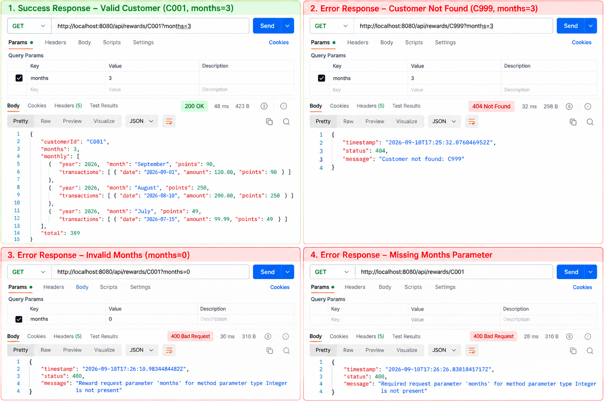

# Rewards Program

Spring Boot REST API for calculating customer reward points.

## Reward rules
- 2 points for every whole dollar spent over $100.
- 1 point for every whole dollar spent between $50 and $100.
- 0 points for the first $50.
- Example: $120 = 90 points.

## API
`GET /api/rewards/{customerId}?months=3`

Both `customerId` and `months` are required. `customerId` must not be blank and `months` must be greater than 0. The requested window is based on full calendar months and includes the current month.

Successful request:
```bash
curl "http://localhost:8080/api/rewards/C001?months=3"
```

Successful response shape:
```json
{
  "customerId": "C001",
  "months": 3,
  "monthly": [
    {
      "year": 2026,
      "month": "September",
      "points": 90,
      "transactions": [{"date":"2026-09-01","amount":120.00,"points":90}]
    }
  ],
  "total": 90
}
```

Error request:
```bash
curl "http://localhost:8080/api/rewards/C999?months=3"
```

404 response shape:
```json
{"timestamp":"2026-09-10T12:00:00Z","status":404,"message":"Customer not found: C999"}
```

## Run
```bash
mvn spring-boot:run
```

## Tests
```bash
mvn test
```

The tests use JUnit 5 and Mockito and cover reward thresholds, negative amounts, input validation, customer-not-found handling, 3-month aggregation, calendar-window filtering, monthly grouping, totals, and multiple customers.

## Postman verification
Create GET requests for the successful and error URLs above. A real Postman screenshot should be captured after running the application; no screenshot is fabricated in this repository.

## Postman API Result Screenshots

The following screenshot documents the requested API success and error response scenarios:



Covered scenarios:
- Valid customer: `C001?months=3` — 200 OK
- Customer not found: `C999?months=3` — 404 Not Found
- Invalid months: `C001?months=0` — 400 Bad Request
- Missing `months` parameter — 400 Bad Request
